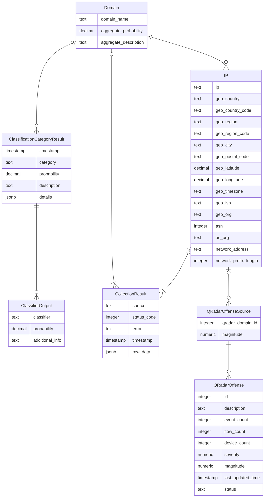

```mermaid
erDiagram

  Domain {
    text domain_name
    decimal aggregate_probability
    text aggregate_description
  }

  IP {
    text ip

    text geo_country
    text geo_country_code
    text geo_region
    text geo_region_code
    text geo_city
    text geo_postal_code
    decimal geo_latitude
    decimal geo_longitude
    text geo_timezone
    text geo_isp
    text geo_org

    integer asn
    text as_org
    text network_address
    integer network_prefix_length
  }

  ClassificationCategoryResult {
    timestamp timestamp
    text category
    decimal probability
    text description
    jsonb details
  }

  ClassifierOutput {
    text classifier
    decimal probability
    text additional_info
  }

  CollectionResult {
    text source
    integer status_code
    text error
    timestamp timestamp
    jsonb raw_data
  }

  QRadarOffenseSource {
    integer qradar_domain_id
    numeric magnitude
  }

  QRadarOffense {
    integer id
    text description
    integer event_count
    integer flow_count
    integer device_count
    numeric severity
    numeric magnitude
    timestamp last_updated_time
    text status
  }

  Domain ||--o{ ClassificationCategoryResult : ""
  Domain o|--|{ CollectionResult : ""
  Domain ||--o{ IP : ""

  IP o|--|{ CollectionResult : ""
  IP o|--o{ QRadarOffenseSource : ""

  QRadarOffenseSource ||--o{ QRadarOffense : ""

  ClassificationCategoryResult ||--o{ ClassifierOutput : ""
```